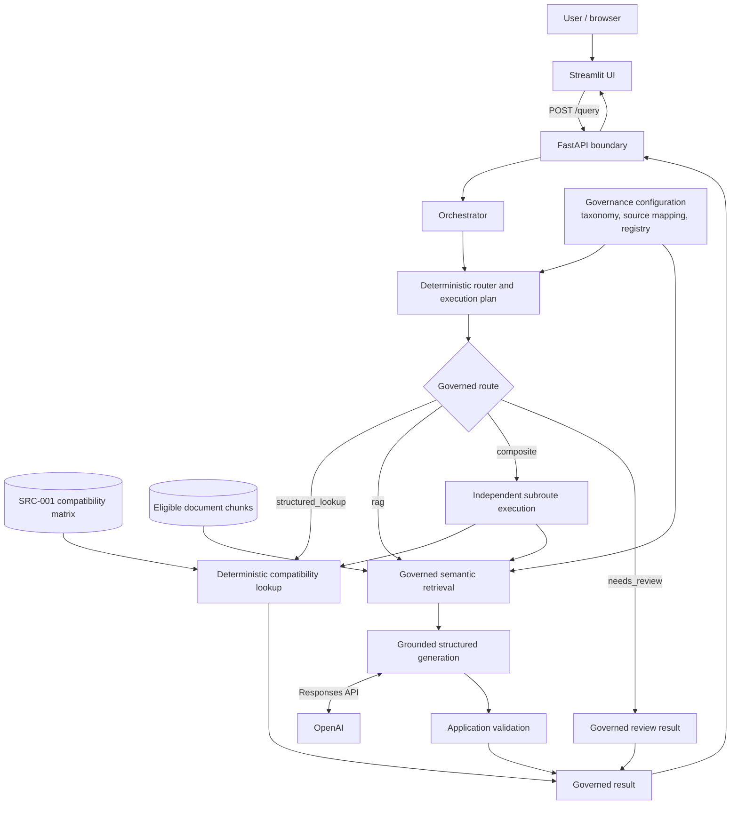
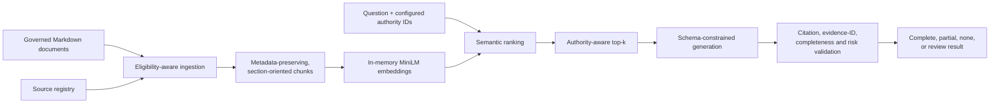

# GenAI Sales Assistant

A deployed, governed prototype for answering synthetic residential-energy product questions without treating every question as an open-ended LLM task.

**[Open the live Railway demo](https://genai-sales-assistant-production.up.railway.app)**

The repository uses synthetic products, rules, and policy documents. It is an engineering prototype, not a real manufacturer's support system or warranty authority.

## Problem

Sales and support questions do not all belong to the same authority. Product compatibility and minimum firmware are deterministic business rules, while installation, integration, operating behavior, and warranty-policy questions may require evidence from approved documents. A single generative path could make a fluent answer while using the wrong authority or strengthening a cautious policy statement.

This project separates those responsibilities. It routes deterministic facts to a governed compatibility matrix, uses retrieval-grounded generation for approved narrative sources, and exposes clarification, partial-answer, insufficient-evidence, and review states instead of guessing.

## Architecture



The router creates a plan; it does not call documents, data sources, or OpenAI directly. The orchestrator executes that plan and preserves the authority boundary between deterministic lookup and retrieval-grounded generation.

## How a Request Is Executed

- **Structured lookup:** compatibility and minimum-firmware questions are parsed into inverter, battery, firmware, and region parameters. Missing parameters produce `clarification_needed`; complete inputs are checked against `SRC-001` without invoking RAG or an LLM.
- **RAG:** approved document questions are retrieved from the eligible corpus at the configured `top_k=6`. The router supplies authoritative source IDs, retrieval reserves authoritative representation when eligible evidence exists, and generation may use only the returned chunks.
- **Composite:** multi-domain questions are decomposed into domain-specific subquestions. Structured and RAG subroutes execute independently, so one missing firmware value does not discard useful installation or warranty guidance. The prototype returns transparent subresults rather than asking an LLM to merge them into one answer.
- **Governed outcomes:** `partial`, `insufficient_evidence`, `needs_review`, and `clarification_needed` are valid application outcomes, not HTTP failures. Unsupported definitive conclusions fail closed instead of being reframed as model guesses.

## Governance and Source Authority

Three configuration artifacts keep business authority outside the model:

- [`knowledge_domain_taxonomy.csv`](consulting/knowledge_domain_taxonomy.csv) defines configured domains and deterministic routing hints.
- [`source_of_truth_mapping.csv`](consulting/source_of_truth_mapping.csv) maps domains to stable authoritative source IDs.
- [`knowledge_source_registry.csv`](consulting/knowledge_source_registry.csv) defines source ownership, region, approval and lifecycle requirements, usage mode, and authority limits.

Ingestion admits only registered document sources whose metadata satisfies approval, lifecycle, region, and effective-date rules. Structured sources with `deterministic_lookup` usage are excluded from RAG. For unresolved dependencies, final authority IDs are resolved from governance configuration rather than trusted from model output.

The synthetic source set contains one structured compatibility matrix and four governed documents covering battery installation, ChargeOne integration, EnergyHub integration, and warranty policy.

## RAG Pipeline



The production retriever uses `sentence-transformers/all-MiniLM-L6-v2` through FastEmbed and cosine similarity over an in-memory index. Chunks retain source ID, title, section, region, approval status, lifecycle status, effective date, and text. Generation uses `gpt-5.6-terra` with low reasoning effort and OpenAI Structured Outputs; application code validates evidence references and derives validation and completeness states.

## Key Engineering Decisions

| Requirement or risk | Choice | Why | Trade-off / limitation |
|---|---|---|---|
| Compatibility and firmware must follow an approved rule | Deterministic CSV lookup through `SRC-001` | Prevents narrative documents or the LLM from inventing compatibility | Requires complete structured parameters and explicit rule maintenance |
| The model must not choose its own authority | Resolve source IDs from governance configuration and pass them into retrieval | Keeps ownership and source-of-truth decisions inspectable | Taxonomy hints and mappings must be maintained as the corpus evolves |
| Questions can span different authority domains | Structured, RAG, review, and composite routes | Preserves each authority boundary while retaining useful subresults | Composite output is transparent but not yet synthesized into polished prose |
| Small synthetic corpus does not justify retrieval infrastructure | In-memory embeddings and local chunk metadata | Simple, reproducible, and sufficient for the current scale | Indexes are rebuilt in process; there is no persistent vector store |
| New retrieval methods should earn promotion | Implemented BM25 and RRF as explicit experimental modes | Allowed a same-corpus comparison without changing the production default | Hybrid retrieval regressed explicit evidence coverage, so semantic retrieval remains default |
| Semantic tool selection should fail closed | Isolated compatibility tool and shadow gate, separate from `/query` | Tests natural-language tool choice without risking production routing | Frozen shadow acceptance criteria were not met; active fallback was rejected |

## Evaluation and Engineering Evidence

Evidence below was re-run or read from committed artifacts on 11 September 2026.

| Area | Verified evidence | Interpretation |
|---|---|---|
| Regression suite | **156 tests passed** with `.venv/bin/python -m unittest discover -s tests` | Covers routing, lookup, ingestion, retrieval, generation validation, orchestration, API, Streamlit helpers, evaluators, and experiments |
| Production retrieval baseline | **17 cases** total, **14 retrieval cases**; Source Hit@6 **100%**; Authoritative Source Hit@6 **100%**; explicit evidence coverage **96.43%**; **0 retrieval failures** | Semantic retrieval remains the production default |
| Lexical / hybrid comparison | BM25 and RRF each produced **89.29%** explicit evidence coverage on the same frozen set | Both remain experimental; RRF was not promoted because it introduced an explicit-evidence regression |
| Answer-level evaluation | A **20-case** executable evaluation set and deterministic/layered evaluator are implemented | Real generation runs are explicit because they incur API calls; no single generic "RAG accuracy" score is used |
| Tool-calling shadow evaluation | Persisted v2 report: **24 cases**, **10 gated cases**, **30 model attempts**, and **0 forbidden executions** | The overall frozen acceptance criteria still failed, so semantic tool selection is not in production `/query` |
| CI | GitHub Actions workflow installs pinned dependencies and runs the complete test suite on pushes and pull requests to `main` | Workflow is implemented; a remote run was not independently verified during this README update |
| Deployment | Railway URL, Streamlit health, structured flow, RAG flow, and composite flow were verified remotely | The deployed prototype runs one container with Streamlit public and FastAPI container-local |

The retrieval metrics use deterministic source, authority, and explicit-evidence checks. Lexical mismatches that may be semantically adequate are surfaced for review rather than automatically labeled retrieval failures.

## Demo

Use the example buttons in the [live application](https://genai-sales-assistant-production.up.railway.app), or try these verified questions:

1. `Is VE Hybrid 8 compatible with HomeCell 15 on firmware 4.2?`
   - Returns `structured_lookup / completed`, a compatible result, minimum firmware `4.2`, and source `SRC-001`.
2. `What is required for PV-surplus charging with ChargeOne 11?`
   - Returns `rag / completed` with visible citations from the ChargeOne and EnergyHub guides.
3. `Can I add HomeCell 15 to my VE Hybrid 8 system, and will that affect my warranty?`
   - Returns a composite `clarification_needed` result: firmware remains missing for deterministic compatibility, while retrofit and warranty subroutes return separate partial answers with citations and unresolved dependencies.

The interface keeps answers and trust-relevant warnings prominent. Citations remain visible; retrieved chunks and route, validation, and rule diagnostics are available in expanders.

## Run Locally

### Python

The container and CI use Python 3.9. Create an environment and install the pinned dependencies:

```bash
python3 -m venv .venv
.venv/bin/python -m pip install -r requirements.txt
```

Provide `OPENAI_API_KEY` as a process environment variable or in a project-root `.env` file. `.env` is ignored by Git and Docker; never commit it.

Start the two processes from the repository root in separate terminals:

```bash
.venv/bin/uvicorn api:app --app-dir src --host 127.0.0.1 --port 8000
```

```bash
.venv/bin/streamlit run streamlit_app.py --server.address 0.0.0.0 --server.port 8501
```

Open `http://127.0.0.1:8501`. The UI calls FastAPI at `http://127.0.0.1:8000` by default; `API_BASE_URL` can override that boundary.

### Docker

The current sprint architecture deliberately runs Streamlit and FastAPI as two processes in one container:

```bash
docker build -t genai-sales-assistant .
docker run --rm --name genai-sales-assistant \
  -p 8501:8501 \
  --env-file .env \
  genai-sales-assistant
```

Only Streamlit is published. FastAPI remains container-local at `127.0.0.1:8000`; Streamlit binds to the managed-platform `PORT` or falls back to `8501`. A first semantic request may require outbound access to download/cache the FastEmbed model, and generation requires outbound access to OpenAI.

### Tests and Evaluation

```bash
.venv/bin/python -m unittest discover -s tests
.venv/bin/python src/evaluate_retrieval.py
```

Real answer-level and tool-calling evaluations are explicit runs because they can make paid model requests. Unit tests use mocks/fakes and do not require a real OpenAI key.

## Repository Structure

```text
.
├── src/                    # API, routing, orchestration, lookup, RAG, validation, evaluators
├── streamlit_app.py        # Thin HTTP client and governed-result presentation
├── data/
│   ├── structured/         # Synthetic compatibility matrix
│   └── documents/          # Synthetic installation, integration, and warranty sources
├── consulting/             # Taxonomy, source governance, policies, and frozen evaluation cases
├── artifacts/              # Committed tool-calling shadow evidence
├── tests/                  # Deterministic unit and integration-style tests
├── .github/workflows/      # Minimal test CI
├── Dockerfile
└── start.sh                # Runs FastAPI and Streamlit in the current single container
```

## Prototype Scope and Limitations

- The corpus and product catalog are synthetic and small; results are not real product or warranty advice.
- Routing is deterministic and configuration-driven. It is transparent but still sensitive to unsupported natural-language phrasing.
- Retrieval uses an in-memory index rebuilt by the serving process; there is no persistent vector database, distributed cache, or retrieval service.
- The application is single-query and stateless. It has no conversation memory, authentication, user accounts, or persistent application database.
- `needs_review` is a governed result state, not an implemented human escalation workflow or integration.
- Composite subresults are not synthesized into a single final conversational answer.
- BM25 and RRF hybrid retrieval are implemented only as experimental evaluation modes; production uses semantic retrieval.
- Compatibility tool calling and its shadow gate are experiments only. They do not replace or augment the production router.
- Reliability is bounded to request IDs, contextual logs, stable technical errors, client/dependency timeouts, and SDK retry limits. No external monitoring or tracing platform is configured.
- The one-container/two-process deployment minimizes infrastructure for this prototype; it is not presented as the only or ideal production topology.
